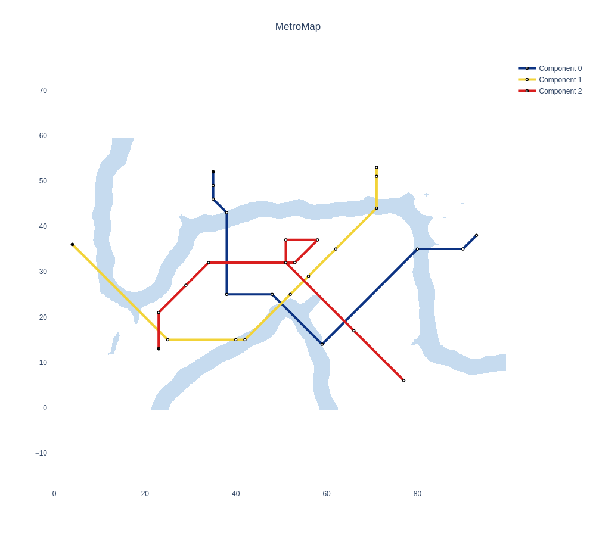

# MetroMap visualizations for Self Organizing Maps

This repository provides a working implementation of the MetroMap visualization technique for self-organizing maps. It supports the visualization of SOMs trained with the [Java SOMToolbox](http://www.ifs.tuwien.ac.at/dm/somtoolbox/index.html) or [minisom](https://github.com/JustGlowing/minisom). The MetroMap solver implements a _branch-and-bound-like_ algorithm. The algorithm only considers points that comply with the octilinearity constraints in its search space. Based on these points a number of possible solutions are generated of which the one with the lowest deviation from the original layout and the least 'sharp' bends is selected. By default the U-Matrix will be used as a background to the metro lines.

> The original implementation of the notebook, which already contained functionality for reading files generated by the SOMToolbox, as well as the base implementation of the plotting utilities (UMatrix, hit histogram and SDH) were provided to us in the course of the Self-Organizing-Systems class at the _TU Wien_ in the winter term 2020.

## Installation
First clone the repository and install the packages required to run the notebook:
```bash
git clone https://github.com/yozoon/SOM-MetroMap.git
cd SOM-MetroMap/
pip install -r requirements.txt
```

After that the _widgetsnbextension_ as well as the _plotlywidget_ jupyter notebook extension have to be enabled. This step is required for properly displaying the _plotly_ FigureWidget (without those steps the widgets won't be displayed at all)
```bash
jupyter nbextension enable --py widgetsnbextension
jupyter nbextension enable --py plotlywidget
```

## Examples
The following image shows the MetroMap that was generated by our implementation. The SOM was trained on the chainlink dataset using the SOMToolbox.

